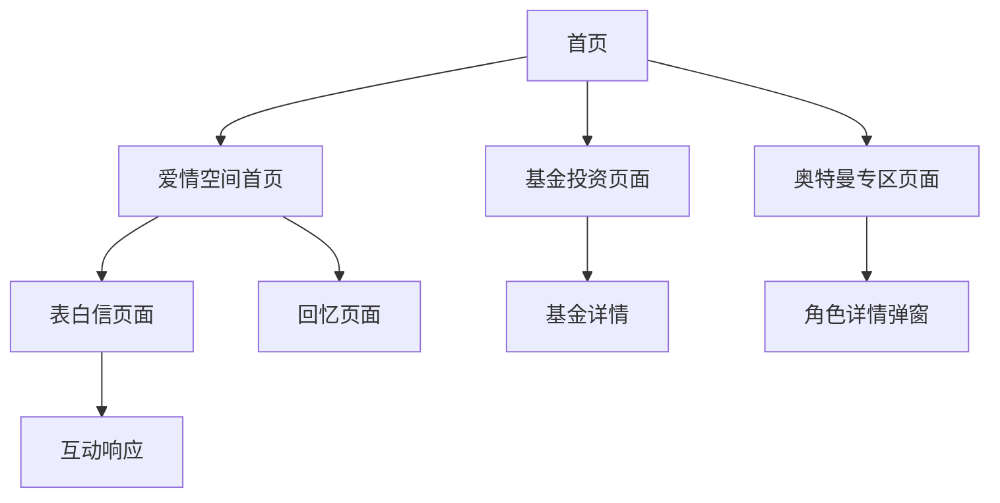

# 个人空间网站产品需求文档

## 1. Product Overview
个人空间网站是一个多功能的个人展示平台，集成了爱情表白、基金投资分析和奥特曼专区三大核心模块。
- 主要解决个人情感表达、投资理财学习和兴趣爱好展示的需求，为用户提供一个温馨浪漫且功能丰富的个人空间。
- 目标是打造一个独特的个人品牌展示平台，体现用户的多元化兴趣和生活态度。

## 2. Core Features

### 2.1 User Roles
本项目采用单用户模式，无需复杂的用户角色区分：

| Role | Registration Method | Core Permissions |
|------|---------------------|------------------|
| 访问者 | 无需注册 | 可浏览所有内容，参与表白互动 |

### 2.2 Feature Module
我们的个人空间网站包含以下主要页面：
1. **首页**：主导航、模块介绍、动画效果
2. **爱情空间首页**：时间计算器、打字机效果、导航菜单
3. **表白信页面**：表白内容展示、互动响应、烟花效果
4. **回忆页面**：爱情回忆展示、时间轴功能
5. **基金投资页面**：基金数据展示、投资分析、图表可视化
6. **奥特曼专区页面**：奥特曼信息展示、角色详情、图片展示

### 2.3 Page Details

| Page Name | Module Name | Feature description |
|-----------|-------------|---------------------|
| 首页 | 主标题区域 | 显示欢迎信息和个人空间介绍，包含浮动装饰动画 |
| 首页 | 模块卡片区域 | 展示三个主要模块的入口卡片，支持点击导航和悬停效果 |
| 爱情空间首页 | 时间计算器 | 实时计算相识时间和相爱时间，精确到秒 |
| 爱情空间首页 | 打字机效果 | 逐字显示爱情文字内容，营造浪漫氛围 |
| 爱情空间首页 | 浮动爱心 | 随机生成浮动爱心动画效果 |
| 表白信页面 | 表白内容 | 完整展示表白信内容，包含日期和署名 |
| 表白信页面 | 互动响应 | 提供"接受"和"拒绝"按钮，支持用户互动 |
| 表白信页面 | 烟花效果 | 接受表白时触发烟花庆祝动画 |
| 回忆页面 | 回忆展示 | 展示重要的爱情回忆和里程碑事件 |
| 基金投资页面 | 基金列表 | 展示多只基金的详细信息和收益数据 |
| 基金投资页面 | 数据分析 | 提供基金收益率、风险等级等分析功能 |
| 基金投资页面 | 投资建议 | 根据基金表现提供投资建议和风险提示 |
| 奥特曼专区页面 | 角色展示 | 展示多个奥特曼角色的基本信息和图片 |
| 奥特曼专区页面 | 详情弹窗 | 点击角色卡片显示详细信息弹窗 |
| 奥特曼专区页面 | 能力介绍 | 展示每个奥特曼的特殊能力和技能 |

## 3. Core Process

**主要用户操作流程：**

用户访问网站首页，浏览三个主要模块的介绍卡片。用户可以选择进入任一模块：

- **爱情模块流程**：进入爱情空间首页 → 观看打字机效果和时间计算 → 点击导航进入表白信页面 → 阅读表白内容并进行互动响应 → 访问回忆页面查看爱情历程
- **投资模块流程**：进入基金投资页面 → 浏览基金列表 → 查看具体基金的详细数据和分析 → 获取投资建议
- **奥特曼模块流程**：进入奥特曼专区 → 浏览奥特曼角色卡片 → 点击查看角色详情 → 了解角色能力和背景故事

## 4. User Interface Design

### 4.1 Design Style
- **主色调**：粉红色系 (#ff6b8b, #ffb6c1, #ff4081)
- **辅助色**：绿色 (#4CAF50)、蓝色 (#2196F3)、橙色 (#FF9800)
- **按钮样式**：圆角渐变按钮，支持悬停放大效果
- **字体**：Arial 无衬线字体，标题使用较大字号
- **布局风格**：卡片式布局，顶部导航，响应式设计
- **动画效果**：浮动元素、打字机效果、渐变过渡

### 4.2 Page Design Overview

| Page Name | Module Name | UI Elements |
|-----------|-------------|-------------|
| 首页 | 主标题区域 | 大标题文字，渐变背景，浮动星星装饰动画 |
| 首页 | 模块卡片 | 圆角卡片，渐变背景，图标装饰，悬停放大效果 |
| 爱情空间首页 | 时间显示 | 大号数字显示，粉色主题，实时更新动画 |
| 爱情空间首页 | 打字机区域 | 逐字显示文本，光标闪烁效果，温馨背景 |
| 表白信页面 | 信件样式 | 信纸背景，手写字体风格，温馨边框装饰 |
| 表白信页面 | 互动按钮 | 圆角按钮，接受为绿色，拒绝为灰色，悬停效果 |
| 基金投资页面 | 数据表格 | 清晰的表格布局，颜色区分涨跌，数据可视化 |
| 奥特曼专区页面 | 角色卡片 | 图片展示，信息叠加，点击弹窗效果 |

### 4.3 Responsiveness
项目采用桌面优先的响应式设计，支持移动端适配，包含触摸交互优化和移动端导航适配。