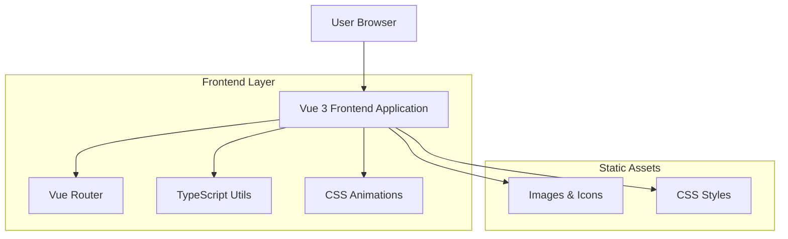
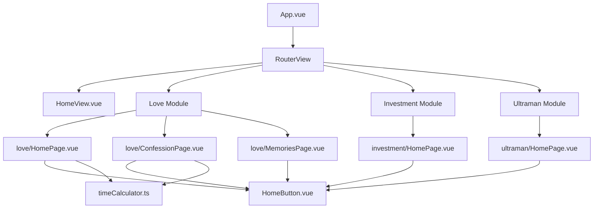

# 个人空间网站技术架构文档

## 1. Architecture design



## 2. Technology Description

* Frontend: Vue\@3.4.29 + TypeScript\@5.4.0 + Vue Router\@4.3.3 + Vite\@5.3.1

* Backend: None (纯前端静态网站)

## 3. Data Service

* 本地数据存储：所有数据通过 TypeScript 接口定义，存储在组件的 ref 响应式变量中

* 时间计算服务：自定义 timeCalculator 工具函数提供精确的时间差计算

* 无需外部数据库或API服务

## 4. 核心模块架构

### 4.1 路由架构

项目采用 Vue Router 进行单页面应用路由管理：

```
/ (首页)
├── /love (爱情模块)
│   ├── / (爱情首页)
│   ├── /confession (表白信页面)
│   └── /memories (回忆页面)
├── /investment (投资模块)
│   ├── / (投资首页)
│   ├── /details (基金详情 - 开发中)
│   └── /portfolio (投资组合 - 开发中)
└── /ultraman (奥特曼模块)
    ├── / (奥特曼首页)
    ├── /gallery (图鉴 - 开发中)
    └── /monsters (怪兽图鉴 - 开发中)
```

### 4.2 组件架构



## 5. 数据模型定义

### 5.1 核心数据接口

**基金数据接口**

```typescript
interface Fund {
  id: number;
  name: string;
  code: string;
  type: string;
  risk: string;
  manager: string;
  scale: string;
  netWorth: number;
  dayGrowth: number;
  weekGrowth: number;
  monthGrowth: number;
  yearGrowth: number;
  threeYearGrowth: number;
  fiveYearGrowth: number;
  establishDate: string;
  description: string;
}
```

**奥特曼数据接口**

```typescript
interface Ultraman {
  id: number;
  name: string;
  alias: string;
  actor: string;
  firstAppear: string;
  height: string;
  weight: string;
  abilities: string[];
  description: string;
  image: string;
  color: string;
}
```

**时间差计算接口**

```typescript
interface TimeDifference {
  years: number;
  months: number;
  days: number;
  hours: number;
  minutes: number;
  seconds: number;
}
```

### 5.2 工具函数

**时间计算工具**

```typescript
export function calculateTimeDifference(
  startDate: Date, 
  endDate: Date
): TimeDifference
```

## 6. 样式架构

### 6.1 CSS 变量系统

```css
:root {
  --love-primary: #ff6b8b;
  --love-secondary: #ffb6c1;
  --love-accent: #ff4081;
  --love-text: #333;
  --love-background: #fff5f8;
}
```

### 6.2 动画系统

* **浮动动画**：心形图标、星星装饰的浮动效果

* **打字机效果**：逐字显示文本的动画实现

* **烟花效果**：表白成功时的庆祝动画

* **悬停效果**：按钮和卡片的交互反馈

## 7. 构建配置

### 7.1 Vite 配置

```typescript
export default defineConfig({
  plugins: [vue()],
  resolve: {
    alias: {
      '@': fileURLToPath(new URL('./src', import.meta.url))
    }
  }
})
```

### 7.2 TypeScript 配置

* 严格模式启用

* 路径别名支持 (@/ 指向 src/)

* Vue 3 Composition API 类型支持

## 8. 部署架构

项目为纯前端静态网站，可部署到以下平台：

* **静态托管服务**：Netlify、Vercel、GitHub Pages

* **CDN 分发**：支持全球 CDN 加速

* **构建输出**：通过 `npm run build` 生成 dist/ 目录

* **预览服务**：通过 `npm run preview` 本地预览构建结果

## 9. 开发工具链

* **开发服务器**：Vite 热重载开发服务器

* **代码检查**：ESLint + Prettier 代码格式化

* **类型检查**：Vue TSC 类型检查

* **包管理**：NPM 依赖管理

* **构建工具**：Vite 现代化构建工具

